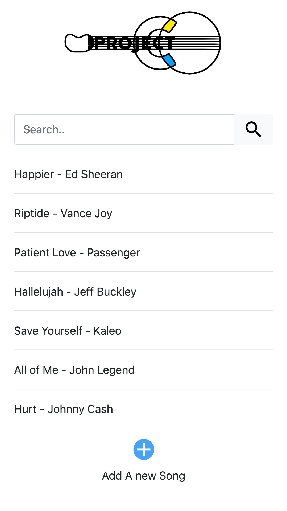
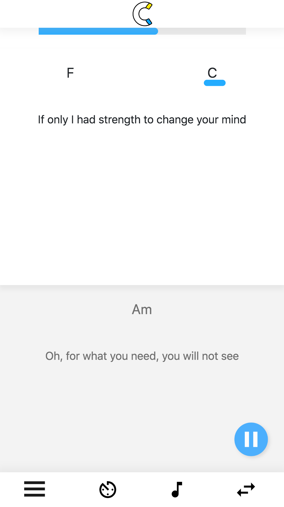
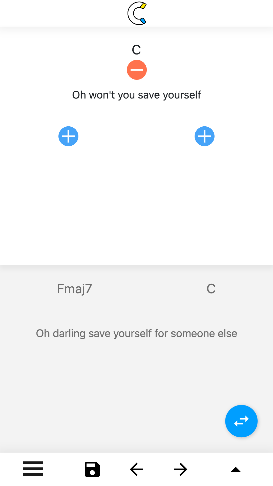

# projectC
A web project for interactive chords for guitar players

Home | Playing a Song | Editing a Song
------------ | ------------- | -------------
  |   |  


## Setup 

For running the laravel project on your local computer you have to
- set up vendor folder with neccessary libraries 
```
  > composer install
```
- create new .env file from .env.example with db setup
- generate Application Encryption Key
```
   > php artisan key:generate
```

## Seed
 
You can seed the database with a few songs using 
```
  > php artisan migrate:fresh --seed

```
## Start Server

start your development server with 

```
  php artisan serve

